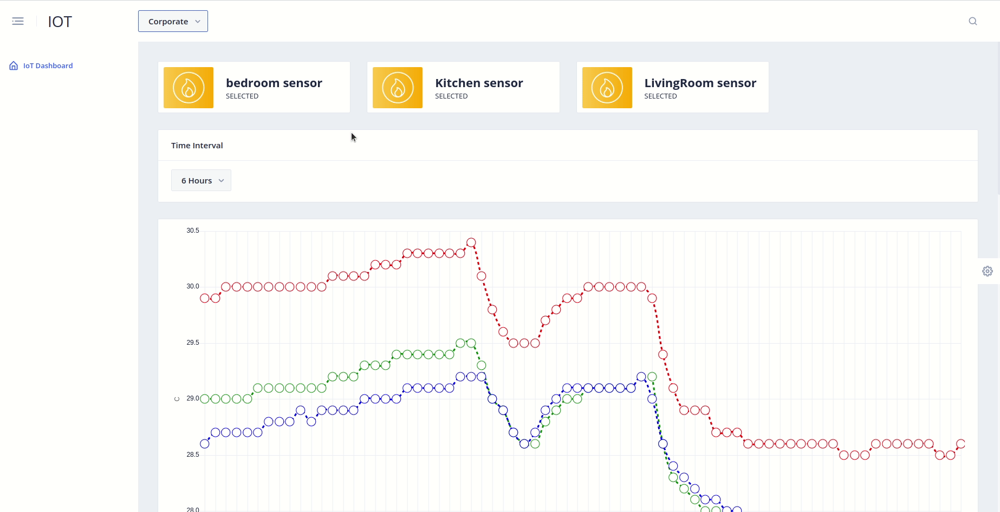
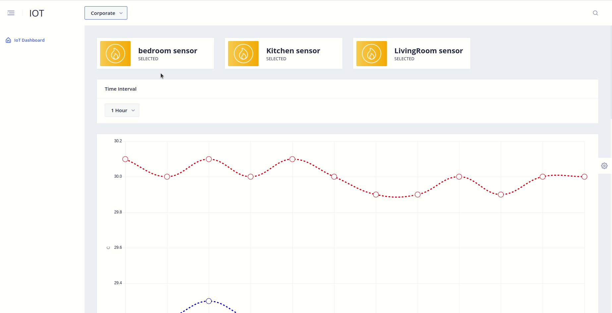
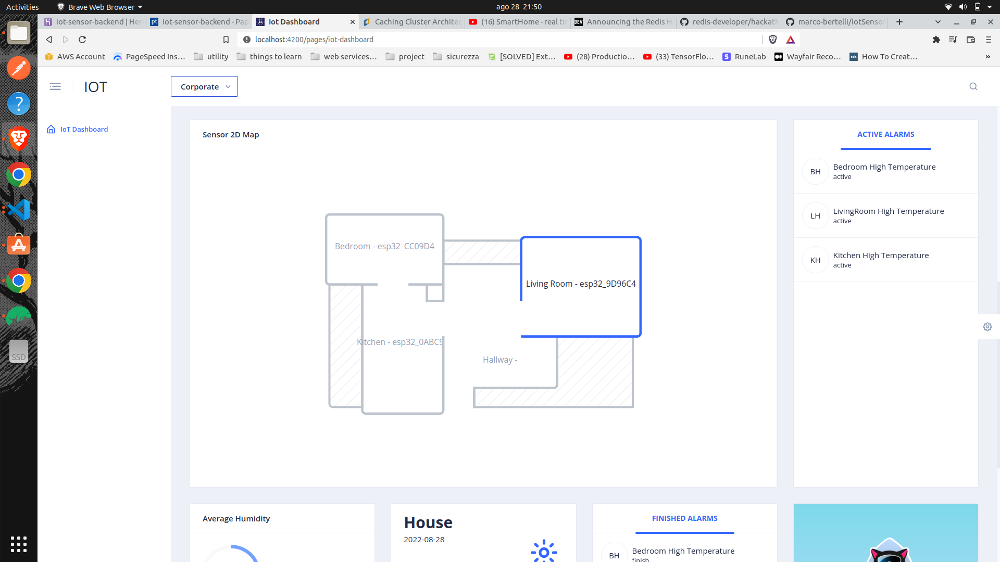
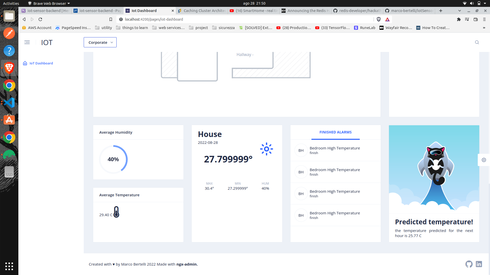

# SmartHome

this is a project that get real time temperature and humidity data from esp32 with DHT22 AM2302 temperature sensor. after this the data
is stored in both redis and MongoDb and processed from the frontend (see the other repo for more frontend info)

[](./assets/baseGraph.gif)

[](./assets/customColor.gif)

[](./assets/map.png)

[](./assets/footer.png)

# Overview video

Here's a short video that explains the project and how it uses Redis:

[](https://www.youtube.com/watch?v=0IFBh0KPuxA)

## How it works
before start is important to understand the app architecture:

[](./assets/architecture.png)

as we can see there are many different parts:
* Backend: write using node js and TS, handle the redis integration using redis OM, MongoDb integration, Aws Iot real time MQTT connection
and Tensorflow js model utilization. Use redis for reading the real time sensor messagges over the MQTT channel "machines" and try to find a sensor associated with it,
if found insert a datalog of the received data in both MongoDb and redis for rapid real time data into the frontend graph.
the alarm logic is associated to the datalogs, if when a datalog is created trigger an alarm rule an active alarm is created and will be closed only when an alarm below the trashold arrive, all the alarms are stored and not deleted.
Tensorflow is used to read a very simple regression model and use it for the next hour predictions.

* Frontend: retrive the data from the backend API to make a graph based on a custom range time, in the graph you can choose the sensor who data you want to see,
there is also the average temperature and humidity cards in the bottom of the dashboard that show you the Average in the **selected range**. 
the alrams are real time and retrived with only 1 minute cache to don't lose the new alarms, as explained before the alrams are created only when a value trigger an alarm trashold.
there is also a home map to see the sensors disposition and have an idea of the space, the "SUN" card show you the **actual** values and not the average.
the last card show you the prediction fo the next hour.
All the components support the **multi theme** feature to personalize the user experience.

* Sensors: send real time temperature and humidity data every 5 minutes, integrated with Aws-Iot. this sensor are made using Mongoose Os, a really cool it framework that help to increase speed using simil JS code. for the code see the Firmware repo

* Redis: used to store the cache and the partial datalogs data to speed up the responses time and keep retrive graphic data simple.

* MongoDb: used to store all other data like sensor and alarms

### How the data is stored:

* basic models.
    * alarms:
        * sensorId: id of the sonsor
        * ruleId: if generated by a rule the ruleId
        * rule: for rules type alram the rule logic
        * name: name to show of the alram
        * type:  enum: ['active', 'finish', 'rule'],
        * triggerValue: start alarm value
        * detriggerValue: end alarm value
        * startDate
        * finishDate
        
    * datalogs:
        * sensorId: id of the sonsor
        * value: temp value
        * measureUnit: at this time only C
        * timestamp: time of the recorded value
        * humidity: stored only in **MongoDb** to keep redis more clean and fast for graph data
        
    * sensors:
        * code
        * type: for now only temperature type
        * name
        * color: the color to show into the graph

the most cool part of the data is the alram logic:
```
{
    "_id" : ObjectId("6300e639830e983ff546f7af"),
    "sensorId" : ObjectId("62fce2bc830e983ff546f775"),
    "rule" : {
        ">" : [
            {
                "var" : "temp"
            },
            25.0
        ]
    },
    "name" : "Bedroom High Temperature",
    "type" : "rule"
}
```

as we can see the logic is saved direct into the alarm! this is possible for the JSON Logic NPM library. (this alarm start if sensor XXX go up to 25 degree)

### How the data is accessed:

Basic endpoints: 
* datalogs/: 
    - /predict: predict the next hour data, using redis cache to keep it for 15 minutes
    - /ambient/now: actual data
    - /:sensorId/:interval: get datalogs of a sensor use redis JSON and redis Search!
    - /ambient/humidity/:interval: Average humidity
    - /ambient/temperature/:interval: Average temp
* alarms/:
    - /active: get active alrams, use redis cache to store it for 1 minutes
    - /finished: get finished alarms: use redis cache to keep it for 3 minutes
* sensors/: get the sensor list, use redis cache to keep it for 30 minutes

### Performance Benchmarks

i don't migrate my app, but before using redis i have made some tries and using Mongo for get the sensor datalogs for an interval it took 300 ms,
and after with redis 200 ms. redis cache also help a **lot** to decrease the number of heavy call (like the prediction call) caching the results.

## How to run it locally?

### Prerequisites

- Node - v16 or higher
- NPM - v7.10.0
- Docker - v19.03.13 (optional)

### Local installation

* use node 16
* npm i
* npm run dev

** for production tests **
* npm run start

## Deployment

used github actions to deploy a docker image on heroku

## For more tecnical info read the dev article here!

[article](https://dev.to/marcobertelli/smarthome-your-home-data-in-real-time-2jjd)

